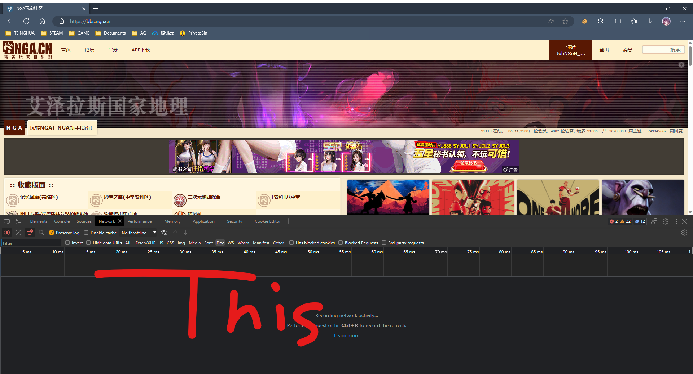
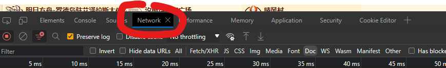
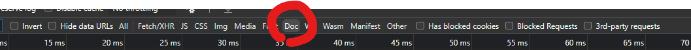
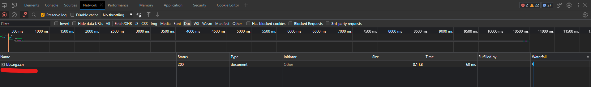
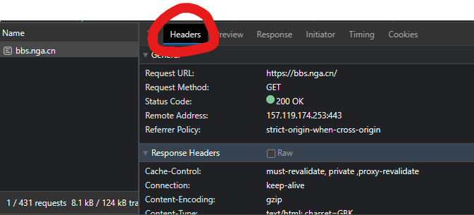
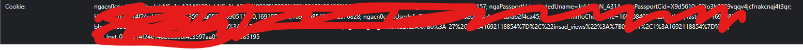

# NGA自动回帖器

提前写稿, 定时发帖!

## 启动之前需要

### 获取你的NGA Cookie

这是为了让程序能以你的身份发帖. **不要**把你的Cookie发给任何其他人, 这将使他们也可以以你的身份搞事情.

1. 打开 [bbs.nga.cn](https://bbs.nga.cn/)
   **不要**使用其他的NGA网址 (如 ngabbs.cn 或 nga.178.com), 它们的Cookie不通用
2. 按`F12`打开浏览器的开发者工具. 根据你的浏览器, 它也可能出现在右边栏.
   
3. 选择`网络`面板, 你的开发者工具很可能是中文的, 这没有关系.
   
4. 选择`文档`筛选器
   
5. 刷新页面
6. 现在, 面板上应该出现1行, 内容类似于下图
   
7. 点击它, 在右边选择`标头`(如果翻译的不一样, 通常来说第1个选项卡就是它)
   
8. 向下滚动, 找到这1大坨, 它左边的标题应当是`Cookie`
   
9. 把右边的内容原样复制

### 配置发帖器

打开 `config.yaml`, 如果要求你选择打开方式, 用记事本就可以.

每一行中, `#` 之后的内容是**注释**, 不生效.

1. 把 `cookie_string` 后面的 `x` 替换成你在上一节复制的内容
2. 设定 `fid` 和 `tid`, 其中 `tid` 可以打开自己的帖子看地址栏
3. `content_file` 后面指定的文件会被逐次作为回复发布
4. `split` 是用来分割每2个回复的分割行, 请参考 `content.txt` 的内容来熟悉它的用法
5. `cron` 指定了发帖的频率, 我预先写了几种并设为了注释, 你可以自由选用或自行编写. [在线参考](https://tools.fun/crontab.html)

### 写文

把你更新的内容写到 `content.txt` 里.

每次发帖时, 会从文件的**开头**开始读取, 直到遇到 `config.yaml` 中配置的分割行.

每次读取的内容会被删除, **即使因为其他原因导致发帖没有成功**.

**确保这不是你文章的唯一备份**

#### 文字中的图片

自动发帖器**无法**帮你上传图片, 你可以采用以下方法:

1. 在你的帖子里发一层楼作为图楼, 并设为隐藏
2. 把你需要的图都作为附件上传到图楼
3. 在图楼的源代码里, 应当能看到形如 `[img]./mon_xxxxxx/...[/img]` 的图片插入, 这段插入代码可以直接用在其他地方而无需再次上传.

## 启动!

运行 `nga-auto-poster.exe`

如果正常启动, 你的电脑上应该会出现一个黑框窗口, 并且显示类型下面的内容 (应该与你的配置对应)

```
2023/08/15 16:10:13 自动回帖启动
目标帖子: https://bbs.nga.cn/read.php?tid=xxx
内容文件: content.txt
分隔符  : ### SPLIT ###
定时器  : * * * * *
```

只要**保持窗口打开**, 程序就会以你设定的频率发帖.

发帖时, 帖子的内容会显示在这个窗口, 发帖成功或报错信息也会显示在这里.

在程序运行时, 你也随时可以编辑 `content.txt` 的内容 (比如再多写一点)

### 没有启动成功?

如果有一个黑框一闪就消失了, 大概是出现了各种问题, 尝试寻找 `nga-auto-poster.年_月_日.log`, 里面应当有报错信息.

## 关闭

把那个黑框关掉就可以了
